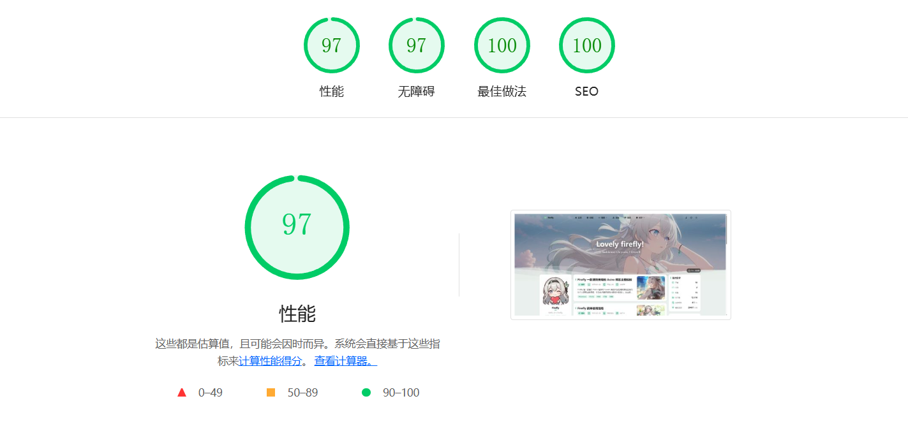

<div align="center">

# Firefly
> 美しくモダンな Astro 静的ブログテーマテンプレート
> 
>  


>
> [](https://github.com/CuteLeaf/Firefly/stargazers)
[](https://github.com/CuteLeaf/Firefly/network/members)
[](https://github.com/CuteLeaf/Firefly/issues)
> 
> [](https://ko-fi.com/Z8Z41NQALY)
> 
> 
[](https://deepwiki.com/CuteLeaf/Firefly)
[](https://afdian.com/a/cuteleaf)

</div>


---
📖 README：
**[简体中文](../README.zh.md)** | **[繁體中文](README.zh-TW.md)** | **[English](../README.md)** | **[日本語](README.ja.md)** | **[Русский](README.ru.md)** 

🚀 クイックガイド：
[**🖥️ライブデモ**](https://firefly.cuteleaf.cn/) /
[**📝ドキュメント**](https://docs-firefly.cuteleaf.cn/) /
[**🍀私のブログ**](https://blog.cuteleaf.cn)

⚡ 静的サイト生成：Astroベースの超高速読み込み速度とSEO最適化

🎨 モダンデザイン：シンプルで美しいインターフェース、カスタマイズ可能なテーマカラー

📱 モバイルフレンドリー：完璧なレスポンシブ体験、モバイル専用最適化

🔧 高度にカスタマイズ可能：ほとんどの機能モジュールは設定ファイルでカスタマイズ可能




>[!TIP]
>Fireflyは、AstroフレームワークとFuwariテンプレートをベースに開発された、清新で美しい個人ブログテーマテンプレートです。技術愛好家やコンテンツクリエイター向けに設計されています。このテーマはモダンなWeb技術スタックを統合し、豊富な機能モジュールと高度にカスタマイズ可能なインターフェースを提供し、プロフェッショナルで美しい個人ブログウェブサイトを簡単に作成できます。
>
>重要なレイアウトでは、Fireflyは革新的に左右のデュアルサイドバー、記事グリッド（多列）レイアウト、メーソンリーレイアウトを追加し、サイト統計、カレンダーコンポーネント、記事目次などの小さなウィジェットを追加してサイドバーをより豊かにし、同時にfuwariのレイアウトシステムも保持しており、設定ファイルで自由に切り替えられます。
>
>**レイアウト設定とデモの詳細については、[Fireflyレイアウトシステム詳細](https://firefly.cuteleaf.cn/posts/firefly-layout-system/)をご覧ください**
>
>Fireflyはi18n多言語切り替えをサポートしていますが、簡体字中国語以外はAI翻訳です。誤りがある場合は、[Pull Request](https://github.com/CuteLeaf/Firefly/pulls)を提出して修正してください。

## ✨ 機能

### コア機能

- [x] **Astro + Tailwind CSS** - モダンな技術スタックベースの超高速静的サイト生成
- [x] **スムーズなアニメーション** - Swupページトランジションアニメーションで滑らかなブラウジング体験
- [x] **レスポンシブデザイン** - デスクトップ、タブレット、モバイルデバイスに完璧に対応
- [x] **多言語サポート** - i18n国際化、簡体字中国語、繁体字中国語、英語、日本語、ロシア語をサポート
- [x] **全文検索** - Pagefindベースのクライアントサイド検索、記事コンテンツのインデックスをサポート

### パーソナライゼーション
- [x] **動的サイドバー** - シングルサイドバー、デュアルサイドバー設定をサポート
- [x] **記事レイアウト** - リスト（単列）、グリッド（多列/メーソンリー）レイアウトをサポート
- [x] **フォント管理** - カスタムフォントをサポート、豊富なフォントセレクター
- [x] **フッター設定** - HTMLコンテンツ注入、完全カスタマイズ可能
- [x] **ライト/ダークモード** - ライト/ダーク/システム追従の3モードをサポート
- [x] **ナビゲーションバーのカスタマイズ** - ロゴ、タイトル、リンクを完全カスタマイズ
- [x] **壁紙モード切り替え** - バナー壁紙、フルスクリーン壁紙、単色背景
- [x] **テーマカラーのカスタマイズ** - 360°色相調整

### ページコンポーネント
- [x] **ゲストブック** - ゲストブックページをサポート
- [x] **お知らせバー** - サイドバーのお知らせ通知をサポート
- [x] **マスコット** - SpineとLive2Dの2つのアニメーションエンジンをサポート
- [x] **サイト統計** - 記事、カテゴリ、タグ数、総文字数などのデータを表示
- [x] **サイトカレンダー** - 今月のカレンダーと今月公開された記事を表示
- [x] **スポンサーページ** - スポンサーリンクのジャンプ、支払いQRコードの表示、スポンサーリスト、記事内スポンサーボタン
- [x] **シェアポスター** - 美しい記事シェアポスターの生成をサポート
- [x] **桜エフェクト** - 桜エフェクトをサポート、フルスクリーン桜アニメーション
- [x] **友人リンク** - 美しい友人リンク展示ページ
- [x] **広告コンポーネント** - カスタムサイドバー広告コンテンツをサポート
- [x] **Bangumi** - Bangumi APIベースのアニメとゲーム記録表示
- [x] **コメントシステム** - Twikoo、Waline、Giscus、Disqus、Artalkコメントシステムを統合
- [x] **訪問者数統計** - Waline、Twikoo組み込みの訪問追跡を呼び出し可能
- [x] **音楽プレーヤー** - Material Design 3 デザインの音楽プレーヤー

### コンテンツ拡張
- [x] **画像ライトボックス** - Fancybox画像プレビュー機能
- [x] **フローティング目次** - 記事の目次を動的に表示、アンカージャンプをサポート、サイドバー目次非表示時に表示
- [x] **メールアドレス保護** - 自動クローラーによるメールアドレスの収集を防ぎ、スパムメールを回避
- [x] **サイドバー目次** - 記事の目次を動的に表示、アンカージャンプをサポート
- [x] **強化されたコードブロック** - Expressive Codeベース、コード折りたたみ、行番号、言語識別をサポート
- [x] **数式サポート** - KaTeXレンダリングエンジン、インラインとブロック数式をサポート
- [x] **ランダムカバー画像** - APIを介してランダムカバー画像の取得をサポート
- [x] **Markdown拡張** - より多くのMarkdown拡張構文サポート

### SEO
- [x] **SEO最適化** - 完全なメタタグと構造化データ
- [x] **RSS購読** - RSSフィードを自動生成
- [x] **サイトマップ** - XMLサイトマップを自動生成、ページフィルタリング設定をサポート
- [x] **統計分析** - Google Analytics、Microsoft Clarityを統合

便利な機能や最適化があれば、[Pull Request](https://github.com/CuteLeaf/Firefly/pulls)を提出してください

## 🚀 クイックスタート

### 環境要件

- Node.js ≤ 22
- pnpm ≤ 9

### ローカル開発

1. **リポジトリのクローン：**
   ```bash
   git clone https://github.com/Cuteleaf/Firefly.git
   cd Firefly
   ```

   **まず自分のリポジトリに[Fork](https://github.com/CuteLeaf/Firefly/fork)してからクローン（推奨）。クローンする前にStarをクリックするのを忘れずに！**

   ```bash
   git clone https://github.com/you-github-name/Firefly.git
   cd Firefly
   ```
3. **依存関係のインストール：**
   ```bash
   # pnpmがインストールされていない場合、まずインストール
   npm install -g pnpm

   # プロジェクトの依存関係をインストール
   pnpm install
   ```

4. **ブログの設定：**
   - `src/config/`ディレクトリ内の設定ファイルを編集してブログをカスタマイズ

5. **コンテンツソースの選択：**

   **オプション A：ローカル Markdown ファイル（デフォルト）**
   - `src/content/posts/`ディレクトリに記事を作成
   - 追加の設定は不要

   **オプション B：Notion データベース**
   - プロジェクトルートに`.env.local`ファイルを作成：
     ```bash
     CONTENT_SOURCE=notion
     NOTION_TOKEN=your_notion_integration_token
     NOTION_DATABASE_ID=your_database_id
     ```
   - 詳細な設定については[Notion統合ガイド](./Notion-Integration-Guide.md)を参照

6. **開発サーバーの起動：**
   ```bash
   pnpm dev
   ```
   ブログは`http://localhost:4321`で利用可能になります

### プラットフォームホスティングデプロイ
- **[公式ガイド](https://docs.astro.build/ja/guides/deploy/)を参照して、Vercel、Netlify、GitHub Pages、Cloudflare Pages、EdgeOne Pagesなどにブログをデプロイしてください。**

   フレームワークプリセット： `Astro`

   ルートディレクトリ： `./`

   出力ディレクトリ： `dist`

   ビルドコマンド： `pnpm run build`

   インストールコマンド： `pnpm install`

## 📖 設定説明

> 📚 **詳細な設定ドキュメント**：[Fireflyドキュメント](https://docs-firefly.cuteleaf.cn/)で完全な設定ガイドを確認してください

### ウェブサイトの言語設定

ブログのデフォルト言語を設定するには、`src/config/siteConfig.ts`ファイルを編集します：

```typescript
// サイト言語を定義
const SITE_LANG = "zh_CN";
```

**サポートされている言語コード：**
- `zh_CN` - 簡体字中国語
- `zh_TW` - 繁体字中国語
- `en` - 英語
- `ja` - 日本語
- `ru` - ロシア語

### 設定ファイル構造

```
src/
├── config/
│   ├── index.ts              # 設定インデックスファイル
│   ├── siteConfig.ts         # サイト基本設定
│   ├── backgroundWallpaper.ts # 背景壁紙設定
│   ├── profileConfig.ts      # ユーザープロフィール設定
│   ├── commentConfig.ts      # コメントシステム設定
│   ├── announcementConfig.ts # お知らせ設定
│   ├── licenseConfig.ts      # ライセンス設定
│   ├── footerConfig.ts       # フッター設定
│   ├── FooterConfig.html     # フッターHTMLコンテンツ
│   ├── expressiveCodeConfig.ts # コードハイライト設定
│   ├── sakuraConfig.ts       # 桜エフェクト設定
│   ├── fontConfig.ts         # フォント設定
│   ├── sidebarConfig.ts      # サイドバーレイアウト設定
│   ├── navBarConfig.ts       # ナビゲーションバー設定
│   ├── musicConfig.ts        # 音楽プレーヤー設定
│   ├── pioConfig.ts          # マスコット設定
│   ├── adConfig.ts           # 広告設定
│   ├── friendsConfig.ts      # 友人リンク設定
│   ├── sponsorConfig.ts      # スポンサー設定
│   └── coverImageConfig.ts   # 記事カバー画像設定
```

## ⚙️ 記事のFrontmatter

```yaml
---
title: My First Blog Post
published: 2023-09-09
description: This is the first post of my new Astro blog.
image: ./cover.jpg  # または「api」を使用してランダムカバー画像を有効化
tags: [Foo, Bar]
category: Front-end
draft: false
lang: zh-CN      # 記事の言語が`siteConfig.ts`のサイト言語と異なる場合のみ設定
pinned: false    # 記事を固定
comment: true    # コメントを有効化
---
```

## � Markdown拡張

Astroがデフォルトで対応している[GitHub Flavored Markdown](https://github.github.com/gfm/)に加えて、いくつかの追加のMarkdown機能があります：

- Admonitions（予告ブロック） - GitHub、Obsidian、VitePressの3つのテーマ設定をサポート ([プレビューと使用方法](https://firefly.cuteleaf.cn/posts/markdown-extended/))
- GitHubリポジトリカード ([プレビューと使用方法](https://firefly.cuteleaf.cn/posts/markdown-extended/))
- Expressive Codeベースの強化コードブロック ([プレビュー](http://firefly.cuteleaf.cn/posts/code-examples/) / [ドキュメント](https://expressive-code.com/))

## �🧞 コマンド

すべてのコマンドはプロジェクトルートディレクトリで実行する必要があります：

| Command                    | Action                                              |
|:---------------------------|:----------------------------------------------------|
| `pnpm install`             | 依存関係をインストール                               |
| `pnpm dev`                 | `localhost:4321`でローカル開発サーバーを起動        |
| `pnpm build`               | `./dist/`にサイトをビルド                           |
| `pnpm preview`             | ビルドされたサイトをローカルでプレビュー            |
| `pnpm check`               | コード内のエラーをチェック                          |
| `pnpm format`              | Biomeを使用してコードをフォーマット                 |
| `pnpm new-post <filename>` | 新しい記事を作成                                    |
| `pnpm astro ...`           | `astro add`、`astro check`などのコマンドを実行      |
| `pnpm astro --help`        | Astro CLIヘルプを表示                               |

## 🙏 謝辞

[fuwari](https://github.com/saicaca/fuwari)テンプレートを開発した[saicaca](https://github.com/saicaca)に深く感謝します。Fireflyはこのテンプレートをベースに二次開発されています。

蛍関連の画像素材の著作権はゲーム[「崩壊：スターレイル」](https://sr.mihoyo.com/)の開発元[miHoYo](https://www.mihoyo.com/)に帰属します。

### 技術スタック

- [Astro](https://astro.build) 
- [Tailwind CSS](https://tailwindcss.com) 
- [Iconify](https://iconify.design)

### インスピレーションプロジェクト

- [fuwari](https://github.com/saicaca/fuwari)
- [hexo-theme-shoka](https://github.com/amehime/hexo-theme-shoka)
- [astro-koharu](https://github.com/cosZone/astro-koharu)
- [Mizuki](https://github.com/matsuzaka-yuki/Mizuki)

### その他の参考
- ブロガー`霞葉`の [Bangumi コレクション](https://kasuha.com/posts/fuwari-enhance-ep2/) ページコンポーネント
- Bilibiliクリエイター `公公的日常` のQ版 [蛍看板娘Spineモデル](https://www.bilibili.com/video/BV1fuVzzdE5y)

## 📝 ライセンス

本プロジェクトは [MIT license](https://mit-license.org/) の下で公開されています。詳細は [LICENSE](../LICENSE) ファイルをご覧ください。

最初は [saicaca/fuwari](https://github.com/saicaca/fuwari) からフォークされました。元の作者の貢献に感謝します。

**著作権表示：**
- Copyright (c) 2024 [saicaca](https://github.com/saicaca) - [fuwari](https://github.com/saicaca/fuwari)
- Copyright (c) 2025 [CuteLeaf](https://github.com/CuteLeaf) - [Firefly](https://github.com/CuteLeaf/Firefly)

MITライセンスに基づき、コードの自由な使用、変更、配布が許可されていますが、上記の著作権表示を保持する必要があります。

## 🍀 貢献者

このプロジェクトに貢献してくれた以下の貢献者に感謝します。質問や提案がある場合は、[Issue](https://github.com/CuteLeaf/Firefly/issues)または[Pull Request](https://github.com/CuteLeaf/Firefly/pulls)を提出してください。

><a href="https://github.com/CuteLeaf/Firefly/graphs/contributors">
>  
></a>

このプロジェクトの基盤を築いた元のプロジェクト[fuwari](https://github.com/saicaca/fuwari)に貢献してくれた以下の貢献者に感謝します。

><a href="https://github.com/saicaca/fuwari/graphs/contributors">
>  
></a>

## ⭐ Star History

[](https://star-history.com/#CuteLeaf/Firefly&Date)


<!-- ALL-CONTRIBUTORS-LIST:START - Do not remove or modify this section -->
<!-- prettier-ignore-start -->
<!-- markdownlint-disable -->

<!-- markdownlint-restore -->
<!-- prettier-ignore-end -->

<!-- ALL-CONTRIBUTORS-LIST:END -->
